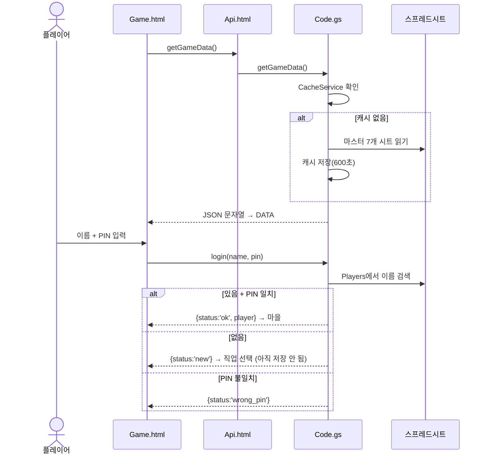
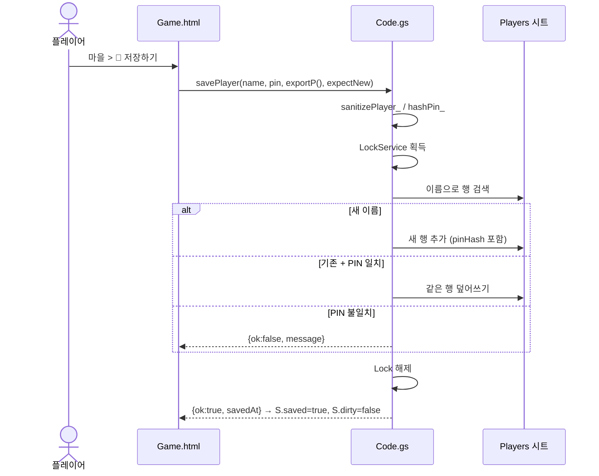
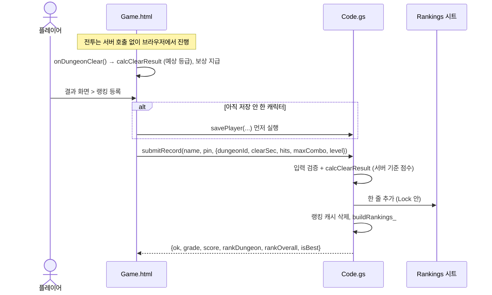

# 서버 API 명세

브라우저(`src/Api.html`)가 `google.script.run`으로 호출하는 서버 함수(`src/Code.gs`)의 명세입니다.
HTTP REST가 아니라 Apps Script RPC이므로 URL·메서드 대신 **함수 이름과 인자**로 호출합니다.

## 1. 공통 사항

| 항목 | 내용 |
|---|---|
| 호출 방식 | `google.script.run.withSuccessHandler(ok).withFailureHandler(err).함수명(인자...)` → `Api.*`가 Promise로 감쌈 |
| 실행 권한 | 배포자(소유자) 권한으로 실행 — 모든 사용자가 같은 스프레드시트에 기록 |
| 인증 | 없음. 캐릭터 단위로 **이름 + PIN 4자리** 확인 |
| 인자·반환 타입 | 문자열·숫자·불리언·배열·일반 객체만 가능. **`Date` 불가** (서버가 `'yyyy-MM-dd HH:mm'` 문자열로 변환) |
| 지연 시간 | 호출 1회 약 0.5~2초 — 전투 중 호출 금지 |
| 예외 | 입력 형식 오류는 `throw new Error(메시지)` → 클라이언트 `catch`로 전달. 업무 규칙 실패는 `{ ok:false, message }` 또는 `status` 값으로 반환 |
| 동시성 | 시트에 쓰는 함수는 `LockService.getScriptLock().waitLock(15000)` 안에서 실행 |
| 로컬 미리보기 | `google`이 없으면 `Api`가 같은 이름의 전역 함수(모의 서버)를 호출 — 명세 동일 |

### 공통 입력 검증
| 인자 | 규칙 | 위반 시 |
|---|---|---|
| `name` | `/^[가-힣A-Za-z0-9_]{2,12}$/` (앞뒤 공백 제거) | `Error('이름은 한글·영문·숫자·_ 로 2~12자여야 합니다.')` |
| `pin` | `/^\d{4}$/` | `Error('PIN은 숫자 4자리여야 합니다.')` |

이름 비교는 대소문자를 무시합니다 (`Hero` = `hero`).

## 2. 함수 목록

| 클라이언트 (`Api.*`) | 서버 함수 | 용도 | 시트 쓰기 | 캐시 |
|---|---|---|---|---|
| `getGameData()` | `getGameData()` | 게임 데이터 로드 | - | `GAME_DATA_V1` 600초 |
| `login(name, pin)` | `login(name, pin)` | 이어하기 / 신규 판별 | - | `FAIL_*` |
| `save(name, pin, data, expectNew)` | `savePlayer(...)` | 저장하기 | Players | - |
| `submitRecord(name, pin, rec)` | `submitRecord(...)` | 랭킹 등록 | Rankings | `RANKINGS_V1` 삭제 |
| `getRankings()` | `getRankings()` | 랭킹 조회 | - | `RANKINGS_V1` 60초 |
| (시트 메뉴 전용) | `adminResetPin_(name, newPin)` — 비공개 | PIN 초기화 | Players | `FAIL_*` 삭제 |

---

### 2.1 `getGameData()`

게임 시작 시 1회 호출. 마스터 시트 7개를 읽어 **JSON 문자열**로 반환합니다 (클라이언트가 `JSON.parse`).

반환 (파싱 후):
```json
{
  "config":   { "GAME_TITLE": "던전 마스터", "MAX_LEVEL": 25, "...": "..." },
  "levels":   [ { "level": 1, "needExp": 40, "hp": 128, "mp": 58, "atk": 14, "def": 5 } ],
  "classes":  [ { "id": "swordsman", "name": "검사", "emoji": "🤺", "emojiFacing": "L", "hpMul": 1.1, "...": "..." } ],
  "skills":   [ { "id": "upper_slash", "classId": "swordsman", "key": "A", "type": "upper", "...": "..." } ],
  "dungeons": [ { "id": "d1", "tier": 1, "monsters": "m_slime,m_goblin", "bossId": "b_goblin_chief", "...": "..." } ],
  "monsters": [ { "id": "m_slime", "ai": "melee", "hp": 90, "...": "..." } ],
  "items":    [ { "id": "p_hp", "type": "potion", "healHp": 40, "...": "..." } ]
}
```
각 배열 원소의 키 = 해당 시트 1행 컬럼명 (`docs/DATA_SCHEMA.md`). 1열이 빈 행은 제외.

오류: 시트가 없으면 `Error("'Config' 시트가 없습니다. ... 초기 설정을 먼저 실행하세요.")` → 클라이언트 `showError`.

---

### 2.2 `login(name, pin)`

| 반환 `status` | 조건 | 추가 필드 |
|---|---|---|
| `'ok'` | 이름 존재 + PIN 일치 | `player` (아래) |
| `'new'` | 저장된 이름 없음 → 클라이언트가 직업 선택으로 이동 | `name` |
| `'wrong_pin'` | PIN 불일치 (실패 횟수 +1) | `message` |
| `'locked'` | 5분 안에 5회 이상 실패 | `message` |

`player` 구조 (`publicPlayer_`):
```json
{
  "name": "용사1", "classId": "swordsman", "level": 5, "exp": 20, "gold": 500,
  "equip": { "weapon": "w_steel", "armor": "a_leather", "accessory": "" },
  "inventory": [ { "id": "p_hp", "qty": 5 } ],
  "cleared": 1, "bestGrades": { "d1": "S" }, "playSec": 1234,
  "updatedAt": "2026-09-29 14:30", "saveCount": 3
}
```
`pinHash`는 절대 반환하지 않습니다.

---

### 2.3 `savePlayer(name, pin, data, expectNew)`

| 인자 | 내용 |
|---|---|
| `data` | 클라이언트 `exportP()` 결과: `{classId, level, exp, gold, equip, inventory, cleared, bestGrades, playSec}` |
| `expectNew` | 이번 세션에서 새로 만든 캐릭터면 `true` (이름 충돌 메시지 구분용) |

처리:
1. `sanitizePlayer_`로 값 정리 — 레벨 1~MAX, 골드 0~999,999,999, 없는 아이템 제거, 슬롯과 타입이 다른 장비 해제, 인벤토리 `INVENTORY_SIZE` 초과분 제거, 등급은 SSS~F만
2. 잠금 획득 → 이름으로 행 검색
3. 없으면 새 행 추가(PIN 해시 기록), 있으면 PIN 해시가 같을 때만 덮어쓰기 (`createdAt` 유지, `saveCount`+1)

| 반환 | 조건 |
|---|---|
| `{ ok:true, isNew, savedAt:'yyyy-MM-dd HH:mm', saveCount }` | 성공 |
| `{ ok:false, message:'이미 다른 사람이 사용 중인 이름입니다...' }` | `expectNew=true` + 다른 PIN으로 이미 저장된 이름 |
| `{ ok:false, message:'PIN이 일치하지 않아 저장할 수 없습니다.' }` | 기존 캐릭터 + PIN 불일치 |

---

### 2.4 `submitRecord(name, pin, rec)`

`rec = { dungeonId, clearSec, hits, maxCombo, level }`

검증 순서:
| 검사 | 실패 반환 |
|---|---|
| `dungeonId`가 Dungeons에 있음 | `{ok:false, message:'알 수 없는 던전입니다.'}` |
| `clearSec > 0` | `'클리어 시간이 올바르지 않습니다.'` |
| `clearSec ≥ rooms × MIN_SEC_PER_ROOM` | `'비정상적으로 빠른 기록이라 등록할 수 없습니다.'` |
| `level ≥ reqLevel` (level은 1~MAX로 보정) | `'입장 레벨보다 낮은 기록은 등록할 수 없습니다.'` |
| 저장된 캐릭터 존재 | `{ok:false, needSave:true, message:'먼저 캐릭터를 저장해야...'}` |
| PIN 일치 | `'PIN이 일치하지 않습니다.'` |

성공 시 등급·점수를 **서버가** `calcClearResult`로 계산해 Rankings에 한 줄 추가하고 랭킹 캐시를 비웁니다.
```json
{ "ok": true, "grade": "SS", "score": 1353, "isBest": true, "rankDungeon": 1, "rankOverall": 2 }
```
`rankDungeon`/`rankOverall`: 1부터 시작, `0` = `RANK_TOP` 밖. `isBest`: 이번 점수가 이 던전 개인 최고와 같음.

---

### 2.5 `getRankings()`

**JSON 문자열** 반환 (클라이언트가 파싱).
```json
{
  "overall":   [ { "name": "검객", "classId": "swordsman", "level": 8, "score": 3860, "clears": 2 } ],
  "byDungeon": { "d1": [ { "name": "검객", "level": 8, "clearSec": 60, "hits": 0, "maxCombo": 40, "grade": "SSS", "score": 1475, "time": "2026-09-29 14:00", "classId": "swordsman", "dungeonId": "d1" } ] },
  "updatedAt": "2026-09-29 14:31"
}
```
규칙 (`buildRankings_`): 이름(소문자)·던전별 최고 점수 1개만 사용(동점이면 빠른 시간). 던전별은 점수 내림차순 → 시간 오름차순. 종합 = 던전별 최고 점수 합, 동점이면 레벨 높은 순. 각 목록 최대 `RANK_TOP`개.

---

### 2.6 `adminResetPin_(name, newPin)` — 관리자 (비공개)

시트 메뉴 `🎮 던전 RPG > 플레이어 PIN 초기화`(`menuResetPin`)에서만 호출합니다. 이름이 `_`로 끝나 **웹 앱에서 `google.script.run`으로 호출할 수 없습니다.** 반환: 결과 문자열.

### 2.7 웹 앱에서 호출되면 안 되는 전역 함수

Apps Script는 `_`로 끝나지 않는 **모든 전역 함수**를 `google.script.run`으로 호출할 수 있게 합니다. 시트 메뉴가 부르는 함수는 이름에 `_`를 붙일 수 없으므로 아래처럼 막아 두었습니다.

| 함수 | 웹 앱에서 호출되면 |
|---|---|
| `resetGameData` | `SpreadsheetApp.getUi()`가 실패 → 아무것도 하지 않음 |
| `menuResetPin` | `getUi()`에서 예외 → 중단 |
| `setup` | 빈 시트만 채우고 기존 데이터는 건드리지 않음 (무해) |
| `clearGameCache`, `showWebAppUrl`, `onOpen`, `onEdit` | 무해 |

**새 함수 규칙**: 내부 함수는 반드시 `_`로 끝나게 짓고, 클라이언트에 공개할 API만 `_` 없이 짓습니다. 데이터를 지우거나 덮어쓰는 관리자 함수는 `_` 비공개로 두고 메뉴용 래퍼에서 `getUi()` 확인 후 호출합니다.

## 3. 호출 순서 (시퀀스)

### 3.1 시작 · 로그인


### 3.2 저장


### 3.3 던전 클리어 · 랭킹 등록


## 4. API를 바꿀 때 체크리스트

- [ ] 서버 함수와 `Api.html` 래퍼를 함께 수정
- [ ] 반환값에 `Date`가 섞이지 않는지 (`fmtTime_`)
- [ ] 쓰기 작업이면 Lock 안에서, PIN 검증 포함
- [ ] `tools/server.test.js`에 성공·실패 케이스 추가
- [ ] 이 문서의 명세·시퀀스 수정
