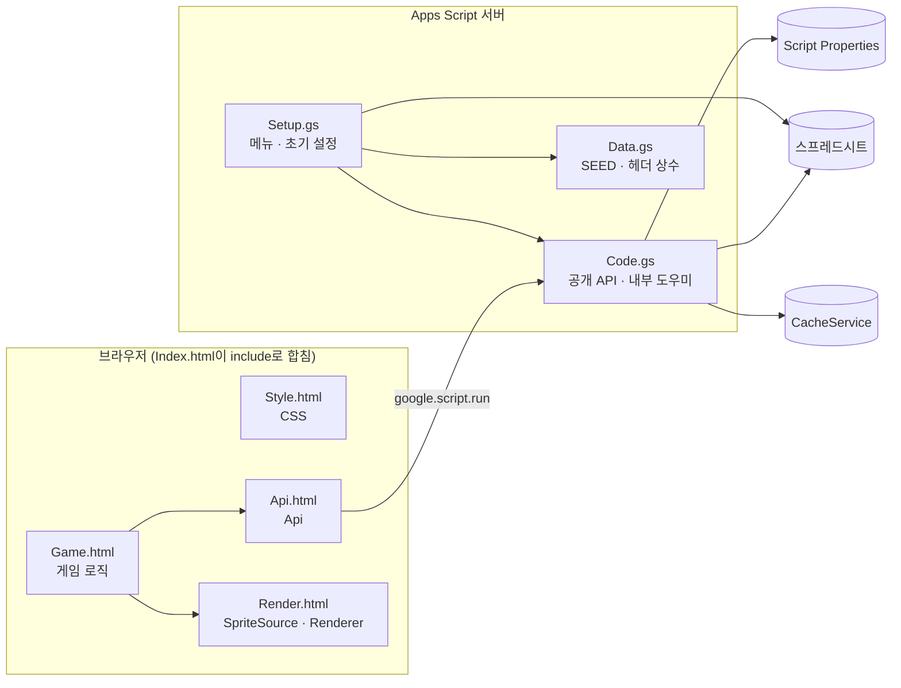
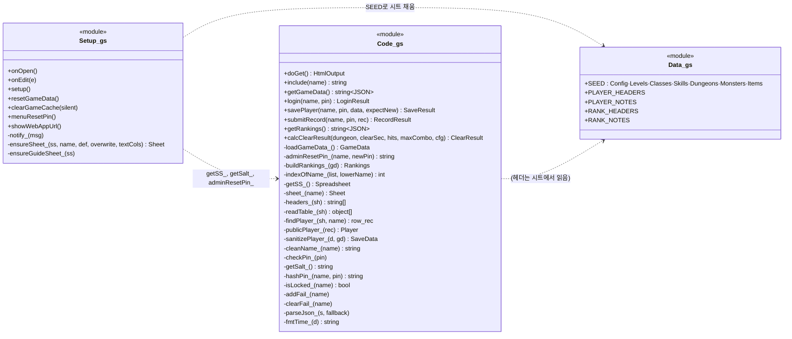
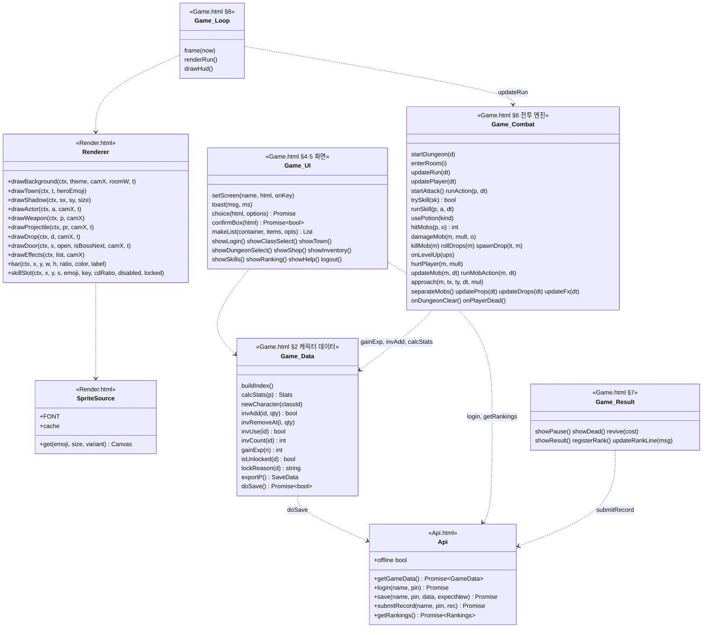
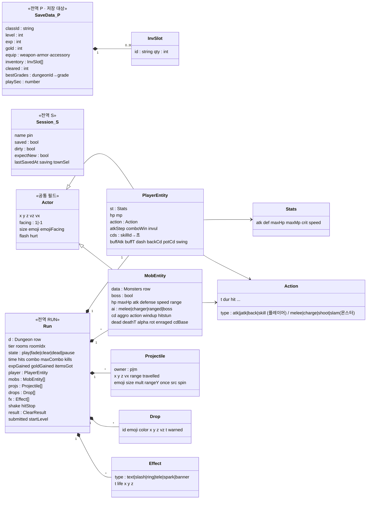
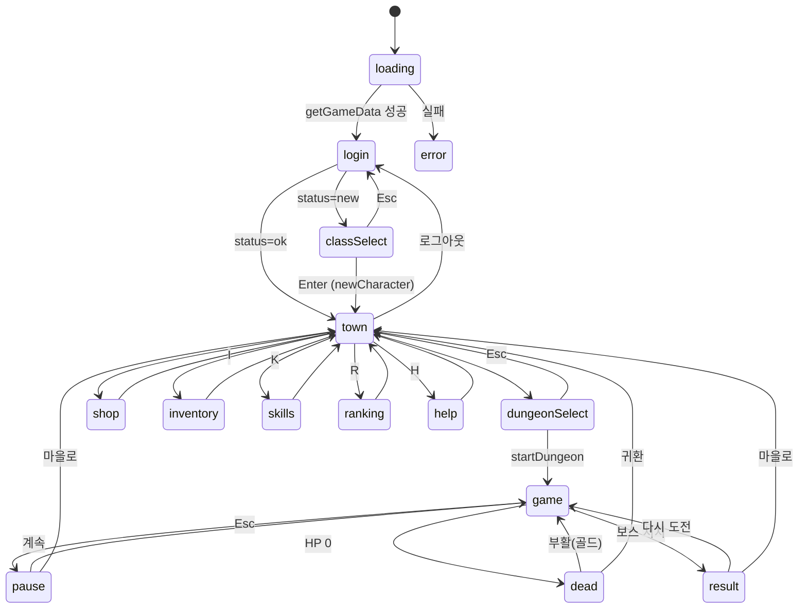
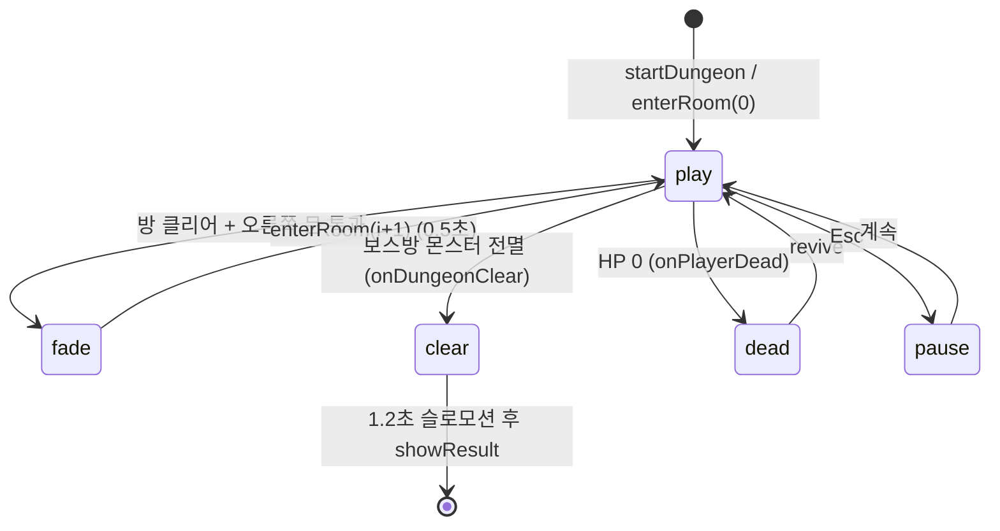
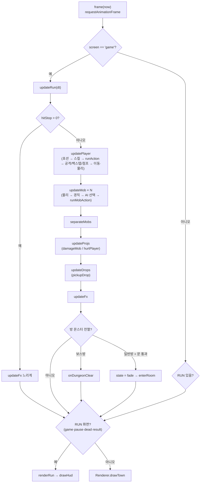
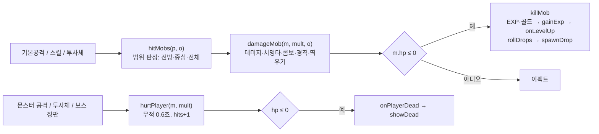

# 함수 · 클래스 다이어그램

코드는 클래스 대신 **파일(모듈) 단위 함수 + 일반 객체**로 짜여 있습니다. 아래 클래스 다이어그램은 모듈을 클래스처럼, 게임 객체(P, RUN, 플레이어, 몬스터 등)를 데이터 클래스로 표현한 것입니다. 모든 이름은 실제 코드와 같습니다.

## 1. 모듈 의존 관계

## 2. 서버 모듈

`+` = `google.script.run`으로 호출 가능한 전역 함수, `-` = `_`로 끝나는 비공개 함수.

## 3. 클라이언트 모듈

## 4. 게임 객체 (데이터 클래스)

## 5. 화면 상태 전이 (`screen`)

## 6. 던전 진행 상태 (`RUN.state`)

## 7. 메인 루프 호출 흐름

## 8. 타격 처리 흐름

