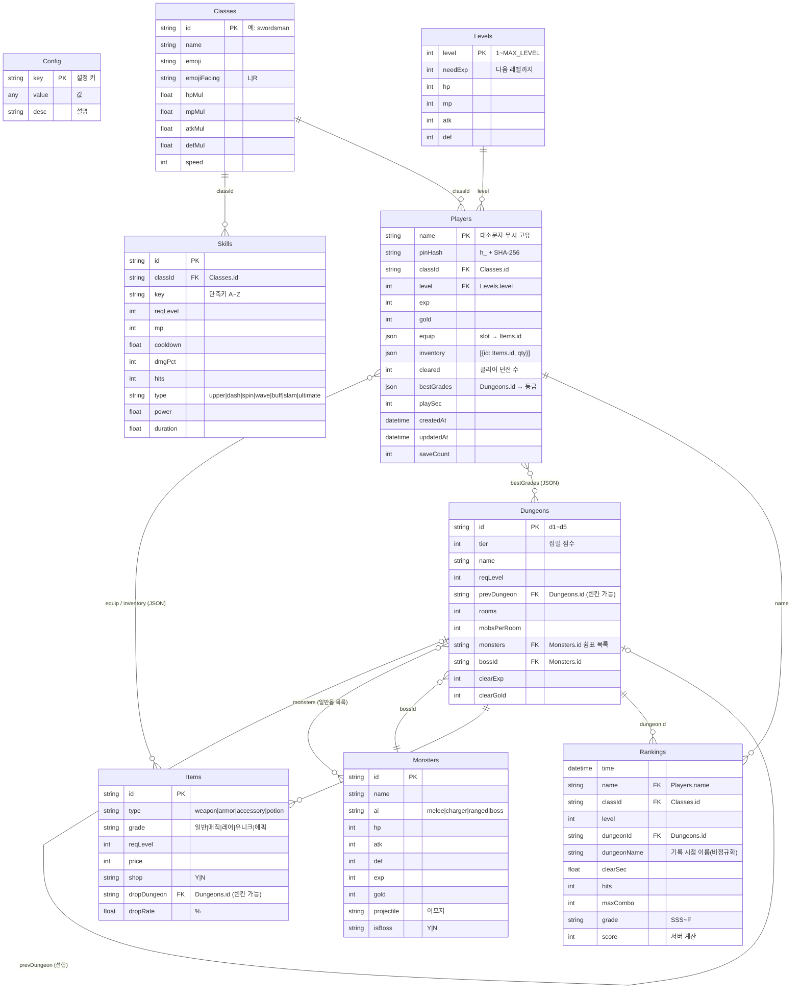

# 데이터베이스 스키마 (ERD)

이 게임의 "데이터베이스"는 Google 스프레드시트입니다. 시트 1개 = 테이블 1개, 1행 = 컬럼명, 2행부터 = 레코드.
컬럼별 설명 전체는 `docs/DATA_SCHEMA.md`(자동 생성)를 보세요. 이 문서는 **테이블 간 관계와 무결성 규칙**을 다룹니다.

## 1. ER 다이어그램

## 2. 테이블 분류

| 구분 | 시트 | 쓰는 주체 | 비고 |
|---|---|---|---|
| 마스터(게임 데이터) | Config, Levels, Classes, Skills, Dungeons, Monsters, Items | 관리자가 시트에서 직접 편집 | 초기값은 `src/Data.gs`의 `SEED`. 수정 시 `onEdit`가 캐시 삭제 |
| 트랜잭션(사용자 데이터) | Players | `savePlayer`, `adminResetPin_` | 이름으로 행을 찾아 덮어씀(UPSERT). 삭제 코드 없음 |
| 로그 | Rankings | `submitRecord` | 추가만(INSERT only). 순위는 조회 시 계산 |
| 설명 | 안내 | `setup()` | 코드가 읽지 않음 |

## 3. 키·무결성 규칙

코드는 외래 키를 강제하지 않습니다. 아래 규칙을 어기면 게임이 해당 항목을 건너뛰거나 기본값으로 대체합니다. `tools/server.test.js`가 초기 데이터(SEED)의 참조 무결성을 검사합니다.

| 규칙 | 어겼을 때 동작 |
|---|---|
| `Skills.classId` ∈ `Classes.id` | 그 스킬이 어떤 직업에도 안 나타남 |
| `Dungeons.monsters`의 각 id ∈ `Monsters.id` | 없는 id는 무시. 모두 없으면 첫 몬스터로 대체 (`startDungeon`) |
| `Dungeons.bossId` ∈ `Monsters.id` | 첫 몬스터가 보스 자리에 나옴 |
| `Dungeons.prevDungeon` ∈ `Dungeons.id` 또는 빈칸 | 없는 id면 선행 조건 없이 레벨만으로 열림 (`isUnlocked`) |
| `Items.dropDungeon` ∈ `Dungeons.id` 또는 빈칸 | 드롭되지 않음 |
| `Config.START_WEAPON/START_ARMOR/START_ITEMS` ∈ `Items.id` | 해당 시작 아이템 없이 생성 |
| `Levels` 행 수 ≥ `Config.MAX_LEVEL` | 최대 레벨 = 둘 중 작은 값 |
| `Players.name` 고유 (대소문자 무시) | `findPlayer_`가 첫 행만 사용 |
| `Players.equip`의 아이템 type = 슬롯 이름 | 저장 시 `sanitizePlayer_`가 빈칸으로 바꿈 |
| `Players.inventory` 길이 ≤ `INVENTORY_SIZE` | 저장 시 초과분 버림 |

## 4. 텍스트 서식 열

Sheets가 숫자·날짜로 자동 변환하지 않도록 `setup()`이 텍스트 서식(`@`)을 지정한 열:
- Players: `name`(A), `pinHash`(B), `equip`(G), `inventory`(H), `bestGrades`(J)
- Rankings: `name`(B)

## 5. 시트 밖 저장소

| 저장소 | 키 | 내용 | 수명 |
|---|---|---|---|
| Script Properties | `SS_ID` | 스프레드시트 ID | 영구 |
| Script Properties | `PIN_SALT` | PIN 해시 salt (**변경 시 모든 PIN 무효**) | 영구 |
| CacheService (script) | `GAME_DATA_V1` | 마스터 7개 시트 JSON | 600초, 시트 수정·메뉴로 삭제 |
| CacheService (script) | `RANKINGS_V1` | 랭킹 계산 결과 JSON | 60초, 랭킹 등록 시 삭제 |
| CacheService (script) | `FAIL_<소문자 이름>` | PIN 실패 횟수 | 300초 (5회 이상이면 잠금) |
| 브라우저 localStorage | `dm_last_name` | 마지막 로그인 이름 (편의용) | 브라우저별 |

## 6. 스키마 변경 절차

1. `src/Data.gs`의 `headers`·`notes`·`rows`에 컬럼 **추가** (기존 컬럼 이름 변경·삭제 금지)
2. 코드는 새 컬럼이 없어도 동작하게 작성 (`num(v, 기본값)` 등)
3. `npm run schema`로 `docs/DATA_SCHEMA.md` 재생성, 이 문서의 ER 다이어그램도 수정
4. 실서비스 시트에 컬럼을 추가하는 방법을 사용자에게 안내 (에이전트는 시트를 직접 못 고치는 경우가 많음)
5. Players에 필드를 추가하면 `PLAYER_HEADERS`, `sanitizePlayer_`, `publicPlayer_`, 클라이언트 `exportP`를 함께 수정하고, 기존 행(값 없음)도 읽히는지 테스트
