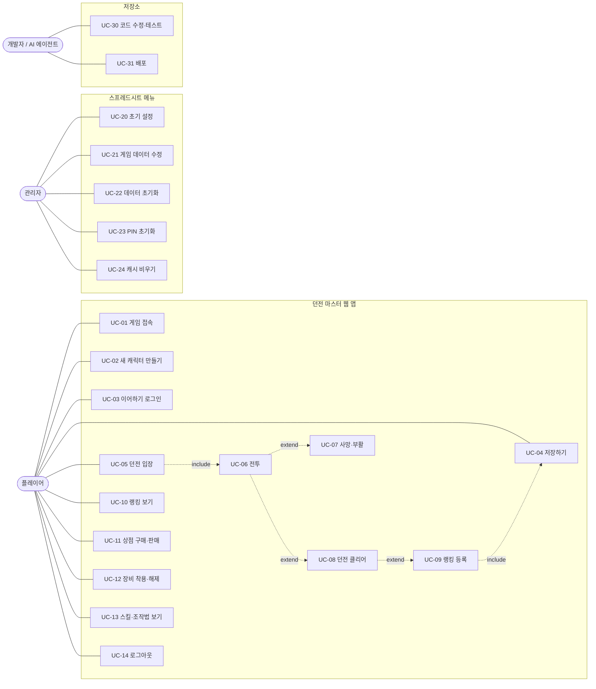

# 유스케이스

기능 요구사항을 사용자 관점에서 정리한 문서입니다. 기능을 추가·변경할 때 해당 유스케이스의 흐름과 **관련 함수**를 함께 확인하고, 바뀐 내용을 이 문서에 반영하세요.

## 1. 액터

| 액터 | 설명 |
|---|---|
| 플레이어 | 웹 앱 주소로 접속해 게임하는 사람. 로그인 계정 없이 이름 + PIN으로 캐릭터를 구분 |
| 관리자 | 스프레드시트 소유자(안병현). 시트로 게임 데이터를 고치고, 시트 메뉴로 관리 기능 사용 |
| 개발자·AI 에이전트 | 저장소 코드를 고치고 clasp로 배포 (사용자 승인 후) |
| 시스템 | Apps Script 서버 (캐시, 잠금, 트리거) |

## 2. 유스케이스 다이어그램

## 3. 유스케이스 목록

| ID | 이름 | 액터 | 서버 호출 | 관련 함수 |
|---|---|---|---|---|
| UC-01 | 게임 접속 | 플레이어 | `getGameData` | `boot`, `buildIndex`, `showLogin` |
| UC-02 | 새 캐릭터 만들기 | 플레이어 | `login` | `showLogin`, `showClassSelect`, `newCharacter` |
| UC-03 | 이어하기 로그인 | 플레이어 | `login` | `showLogin`, `publicPlayer_` |
| UC-04 | 저장하기 | 플레이어 | `savePlayer` | `doSave`, `exportP`, `sanitizePlayer_` |
| UC-05 | 던전 입장 | 플레이어 | - | `showDungeonSelect`, `isUnlocked`, `startDungeon` |
| UC-06 | 전투 | 플레이어 | - | `updateRun`, `updatePlayer`, `trySkill`, `updateMob` 등 |
| UC-07 | 사망·부활 | 플레이어 | - | `onPlayerDead`, `showDead`, `revive` |
| UC-08 | 던전 클리어 | 플레이어 | - | `onDungeonClear`, `showResult` |
| UC-09 | 랭킹 등록 | 플레이어 | `submitRecord` (+`savePlayer`) | `registerRank`, `calcClearResult` |
| UC-10 | 랭킹 보기 | 플레이어 | `getRankings` | `showRanking`, `buildRankings_` |
| UC-11 | 상점 구매·판매 | 플레이어 | - | `showShop`, `invAdd`, `invRemoveAt` |
| UC-12 | 장비 착용·해제 | 플레이어 | - | `showInventory`, `calcStats` |
| UC-13 | 스킬·조작법 보기 | 플레이어 | - | `showSkills`, `showHelp` |
| UC-14 | 로그아웃 | 플레이어 | (`savePlayer`) | `logout` |
| UC-20 | 초기 설정 | 관리자 | - | `setup`, `ensureSheet_` |
| UC-21 | 게임 데이터 수정 | 관리자 | - | 시트 편집 → `onEdit` |
| UC-22 | 데이터 초기화 | 관리자 | - | `resetGameData` |
| UC-23 | PIN 초기화 | 관리자 | - | `menuResetPin`, `adminResetPin_` |
| UC-24 | 캐시 비우기 | 관리자 | - | `clearGameCache` |
| UC-30 | 코드 수정·테스트 | 개발자 | - | `npm test`, `npm run build` |
| UC-31 | 배포 | 개발자 | - | `npm run push`, `npm run deploy` |

## 4. 상세 흐름

### UC-01 게임 접속
- **사전 조건**: 웹 앱이 배포되어 있고, `setup()`이 실행되어 시트가 있음
- **기본 흐름**: ① 게임 주소 접속 → ② 로딩 화면 → ③ `getGameData`로 데이터 수신 → ④ 로그인 화면(마지막 이름 자동 입력)
- **예외**: 시트 없음 → 오류 화면에 "초기 설정을 실행하세요" 안내
- **비고**: 웹 앱은 iframe 안에서 열리므로 키가 안 먹으면 화면을 클릭 (안내 문구 표시)

### UC-02 새 캐릭터 만들기
- **기본 흐름**: ① 새 이름 + PIN 입력 → ② `login` = `new` → ③ 직업 선택(←→, Enter) → ④ 시작 골드·장비·포션으로 캐릭터 생성 → ⑤ 마을 (상태: **저장 안 됨**)
- **예외**: 이름 형식 오류(2~12자, 한글·영문·숫자·_) / PIN 형식 오류 → 입력창 아래 메시지
- **사후 조건**: 서버에는 아무것도 기록되지 않음. `S.expectNew = true`
- **비즈니스 규칙**: 같은 이름이 이미 저장돼 있으면 UC-03으로 처리됨 (PIN이 다르면 wrong_pin)

### UC-03 이어하기 로그인
- **기본 흐름**: ① 이름 + PIN → ② `login` = `ok` → ③ 저장된 캐릭터로 마을
- **예외**: PIN 불일치 → 메시지, PIN 칸 비움. 5분 안에 5회 실패 → 5분 잠금

### UC-04 저장하기
- **트리거**: 마을 메뉴 `💾 저장하기`, 로그아웃 시 "저장하고 로그아웃", 미저장 캐릭터로 랭킹 등록 시
- **기본 흐름**: ① `savePlayer(name, pin, exportP(), expectNew)` → ② 새 이름이면 행 추가(PIN 해시 기록), 기존이면 같은 PIN일 때 덮어쓰기 → ③ "저장 완료(시각)" 토스트, 캐릭터 카드에 ✔ 저장됨
- **예외**: 새 캐릭터인데 그사이 다른 사람이 같은 이름으로 저장 → "이미 사용 중인 이름" / PIN 불일치 → 거부
- **비즈니스 규칙**: **자동 저장 없음**(사용자 결정). 저장 안 된 진행이 있으면 캐릭터 카드에 표시, 창을 닫으려 하면 브라우저 경고

### UC-05 던전 입장
- **기본 흐름**: ① 마을 > 던전 입장 → ② 목록에서 선택(정보: 권장 레벨, 방 수, 보스, 최고 등급) → ③ Enter
- **비즈니스 규칙**: 입장 조건 = `레벨 ≥ reqLevel` **그리고** `prevDungeon` 클리어. 잠긴 던전은 이유 표시

### UC-06 전투
- **기본 흐름**: ① 방에 몬스터 배치 → ② 이동·공격·스킬·포션으로 처치 (EXP·골드 즉시 획득, 아이템 드롭 → 밟으면 줍기) → ③ 전멸 시 오른쪽 문 열림 → ④ 문을 지나 다음 방 → 마지막 방은 보스
- **대안 흐름**: 레벨업 → HP·MP 전부 회복, 새 스킬 알림 / Esc → 일시정지(계속 또는 마을로; 마을로 가면 클리어 기록 없음, 얻은 것은 유지)
- **비즈니스 규칙**: 서버 호출 없음. 인벤토리가 가득 차면 줍지 못함. 방을 떠날 때 남은 드롭은 자동으로 주움

### UC-07 사망·부활
- **기본 흐름**: HP 0 → 사망 화면 → 부활(비용 = `REVIVE_COST_PER_TIER` × 던전 단계 골드) → HP·MP 전부 회복, 2.5초 무적, **피격 횟수 +3**
- **대안 흐름**: 골드 부족 또는 선택 → 마을로 귀환 (얻은 EXP·아이템 유지)

### UC-08 던전 클리어
- **기본 흐름**: ① 보스방 전멸 → ② 슬로모션 + "DUNGEON CLEAR!" → ③ 등급 계산(`calcClearResult`), 클리어 보너스 EXP(등급 배율)·골드 지급, `cleared`·`bestGrades` 갱신 → ④ 결과 화면(등급, 시간, 피격, 콤보, 처치 수, 획득 EXP·골드·아이템)
- **선택**: 랭킹 등록(UC-09) / 다시 도전(R) / 마을로(Esc)

### UC-09 랭킹 등록
- **사전 조건**: 결과 화면, 이번 기록을 아직 등록하지 않음
- **기본 흐름**: ① Enter → ② (저장 안 된 캐릭터면 "먼저 저장" 확인 → UC-04) → ③ `submitRecord` → ④ "등록 완료 — 던전 N위 · 종합 M위 · 점수"
- **예외**: 비정상적으로 빠른 기록, 입장 레벨 미만, PIN 불일치 → 거부 메시지
- **비즈니스 규칙**: 점수는 서버가 다시 계산. 같은 기록은 1회만 등록

### UC-10 랭킹 보기
- **기본 흐름**: 마을 > 랭킹(R) → 탭(←→): 종합 / 던전 5개 → 내 이름 강조. Space = 새로고침
- **비즈니스 규칙**: 던전별 = 이름별 최고 점수 1개, 종합 = 던전별 최고 점수 합, 각 `RANK_TOP`명

### UC-11 상점 구매·판매
- **기본 흐름**: 구매 탭 — `shop=Y` 아이템, Enter로 1개(포션은 Shift+Enter 10개) / 판매 탭 — 인벤토리 아이템을 가격의 30%에 판매
- **예외**: 골드 부족, 인벤토리 가득(30칸, 포션은 99개씩 겹침)

### UC-12 장비 착용·해제
- **기본 흐름**: 인벤토리(I) → 장비 선택 Enter = 착용(기존 장비는 인벤토리로) / 착용 슬롯 선택 Enter = 해제. 상세 창에 현재 장비 대비 능력치 증감 표시
- **예외**: 착용 레벨 미달, 해제 시 인벤토리 가득

### UC-13 스킬·조작법 보기
- 스킬(K): 직업 스킬 목록, 습득 레벨·MP·쿨타임·데미지 / 조작법(H): 키 안내

### UC-14 로그아웃
- 저장 안 된 진행이 있으면 "저장하고 로그아웃 / 저장하지 않고 로그아웃 / 취소" 선택

### UC-20 초기 설정 (관리자)
- 시트 메뉴 `1) 초기 설정` → 없는·빈 시트만 만들고 SEED로 채움, `SS_ID`·`PIN_SALT` 생성. 여러 번 실행해도 기존 데이터 유지

### UC-21 게임 데이터 수정 (관리자)
- 시트에서 값 수정 → `onEdit`가 게임 데이터 캐시 삭제 → 다음 접속부터 반영 (재배포 불필요). 1행 컬럼명은 수정 금지

### UC-22 데이터 초기화 (관리자)
- 시트 메뉴 → 확인 창 "예" → 마스터 7개 시트를 SEED로 덮어씀. Players·Rankings 유지. 웹 앱에서 호출되면 아무것도 하지 않음

### UC-23 PIN 초기화 (관리자)
- 시트 메뉴 → 이름 입력 → 새 PIN 입력 → 해시 갱신, 실패 잠금 해제

### UC-24 캐시 비우기 (관리자)
- 시트 메뉴 → 게임 데이터·랭킹 캐시 삭제 (시트 수정이 바로 반영 안 될 때)

### UC-30 코드 수정·테스트 / UC-31 배포 (개발자)
- `AGENTS.md` 4장 작업 흐름과 완료 조건을 따름. 배포는 사용자 승인 후, 고정 배포 ID(`npm run deploy`)로

## 5. 비기능 요구사항

| 항목 | 요구 |
|---|---|
| 조작 | 키보드만으로 모든 화면 조작 가능 (마우스 클릭도 지원) |
| 동시 사용 | 여러 명이 각자 플레이. 저장·등록은 LockService로 순서 보장 (실시간 멀티플레이 아님) |
| 응답성 | 전투 중 서버 호출 없음. 60fps 목표 (requestAnimationFrame) |
| 보안 | PIN 원문 미저장(해시). 5회 실패 잠금. 관리자 기능은 웹 앱에서 호출 불가 |
| 데이터 관리 | 게임 데이터는 시트로 관리, 재배포 없이 반영 |
| 확장 | 직업·스킬·던전·몬스터·아이템은 시트 행 추가로 확장. 그래픽은 `Render.html`에서 교체 |
| 언어 | 한국어 UI |

## 신규 직업·이벤트 유스케이스

신규 사용자는 검사·격투가·거너 중 하나를 선택합니다. 직업마다 스킬 7개를 제공하며, 격투가는 장갑, 거너는 권총을 착용하고 시작합니다.

관리자는 시트 메뉴에서 누락된 신규 직업 데이터를 추가합니다. 이벤트 발송을 확인하면 그 시점에 저장된 사용자 명단을 확정합니다. 반복 실행은 기존 명단을 그대로 사용합니다.

대상 사용자는 마을에서 도착 안내를 보고 저장할 때 보상을 받습니다. 가방이나 골드 한도가 부족하면 보상 전체를 보관합니다. 다른 접속에서 먼저 수령한 경우에는 오래된 상태로 저장할 수 없으며 재로그인을 안내합니다.
